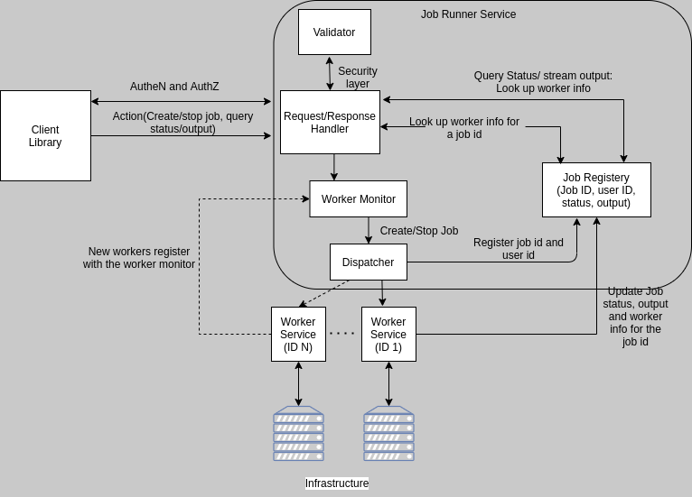

# Remote Job Worker Service

## Table of Contents

- [Remote Job Worker Service] (#remote-job-worker-service)
  - [Requirements](#requirements)
    - [Library](#library)
    - [API](#api)
    - [Client](#client)
  - [Users](#users)
  - [User Actions](#user-actions)
  - [High Level Design](#high-level-design)
  - [Out of Scope](#out-of-scope)
  - [Additional information](#additional-information)
    - [Security](#security)
    - [gRPC](#grpc)

## Requirements

### Library

+Worker library with methods to start/stop/query status and get the output of a job.
+Library should be able to stream the output of a running job.
    + Output should be from start of process execution.
    + Multiple concurrent clients should be supported.
+Add resource control for CPU, Memory and Disk IO per job using cgroups.

### API

+GRPC API to start/stop/get status/stream output of a running process.
+Use mTLS authentication and verify client certificate. Set up strong set of cipher suites for TLS and good crypto setup for certificates. Do not use any other authentication protocols on top of mTLS.
+Use a simple authorization scheme.

### Client

+CLI should be able to connect to worker service and start, stop, get status, and stream output of a job.

## Users

1) Standard user: A standard user can start a job, with default/predefined CPU,Memory and I/O usage policy. Can only stop, request status and stream output for jobs they created.

2) Admin User: An admin user can start jobs with elevated/customized CPU,Memory and I/O usage policy. Can stop, request status and stream output ANY jobs created by ANY user.

## User Actions

| Action        | Contract    | User Behavior |
| :------------ |:------------| :-------------|
| Start Job.    | - Accept the user job to run on machine.   - Return job ID, error to denote success or failure.   - Associate the job id with user id. | Same behavior for admin and standard user |
| Stop Job.     | - Accept a job ID that needs to be stopped.   - Verify if the job was created by the user(if standard user). |   admin user can stop job started by any user. |
| Query Status. | - Accept a job ID to be queried.   - Return job status In progress, completed or stopped.| Admin user can query status of job started by any user. |
| Stream output | Check if a job is in progress.      |    admin user can stream output of any job started by any user. |
| List jobs     | Check if a job is in progress.        |    List all jobs triggered by user. admin can list jobs triggered by other users. |

Prerequisite for every action: Authenticate service and client(mTLS). Authorization check for user, check user privilege with job request.

Each action will be implemented as a gRPC API.

## High Level Design

Architecture:

 

Library:

API

Client: Cli implementation that invokes the APIs accepts 

Flow Diagram for Create and Stop job Actions:

 

Flow Diagram for Query Status and Stream Output Actions:

## Out of Scope

- User creation and management: We will use pre defined 1 standard user and 1 admin user.
- Job Registry component does not provide persistence. will store in-memory and use pre defined clean up rule.
- Worker Monitor:
  - No support for registering new workers/monitoring health
  - Will use simple round-robin to choose the worker machine.
  - For this prototype we will assume we have only one worker service(so only one linux machine)
- Pre existing security tokens already exist for Job Runner service and Job Worker service.
- List jobs makes it easy for user and admin to perform other actions. Low Priority for now.
- Versioning support for APIs.

## Additional information

### Security

mTLS will be used to secure client and service request.

Signature scheme: Ed25519.

Benefits: Faster than RSA, more secure than ECDSA.

Request Authorization : Pre defined API keys can be used. (May revisit this in the coming days).

Action Authorization: Application logic links job id with user id and verifies if the user has privilege to execute the job.

### gRPC

Service APIs will be gRPC endpoints.

Serialization/De-serialization library to be used with gRPC consideration - Flatbuffers vs google Protobuf:

I ran a small PoC to benchmark serializing and deserializing performance of Google Protobuf and Flatbuffers for a simple message(string and int) of size 8 kb. The flatbuffers lib performance was promising:
    Pros: Flatbuffers have an almost negligible de-serialization time compared to protobuf
    Cons: The serialized payload size was 9% larger than the payload serialized by protobuf
    Nice bonus: Flatbuffers schema compiler can generate .fbs schema from a proto file.

Payload size, flexibility, learning curve for Flatbuffers will be evaluated and a switch will be made to protobuf if the trade off is not worth it.

Protobuf schema is defined [here](../api/proto/jobService.proto). Flatbuffers schema is defined [here](../api/fbs/jobService.fbs).

**update**: After discussion, using standard gRPC and protobuf for the prototype.

### Streaming output of a job

When a job is created, we can pipe the output of the system call to an golang IO object to store the output in a buffer. The worker service will then use gRPC stream to continuously read this buffer and send the output to the job registry component, where it will be saved in an in-memory buffer by an io Reader object. When a valid "Stream output" API is called, we can loop through this buffer using the reader object and send chunks of bytes to the protobuf message structure(JobStream) and use gRPC stream again to send it to the client. The output streaming will always start form the beginning of a job execution.
Once the job ends or is stopped, we no buffers with job output.

The flow will be:
Job(Linux machine) ---> Worker Service(IO Reader) ---gRPC steam--->  Job runner Service(Job Registry) ---gRPC stream---> Client

For this prototype, stdout and stderr have the same buffer. This can be separated if required.
